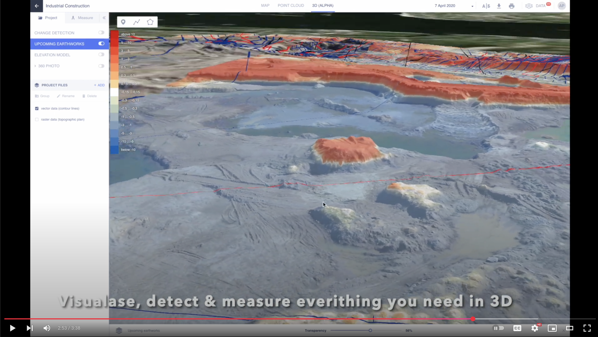
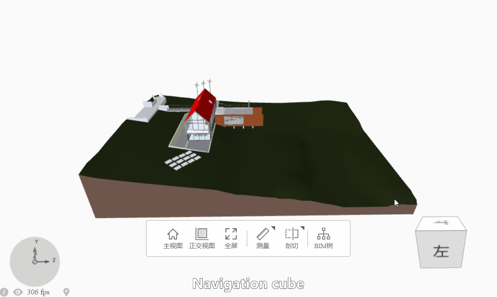

# Hilkov Ivan Andreevich

**Lead Frontend Engineer**

---

## Contact Information

- **Phone:** [+7 (925) 834-55-30](tel:+79258345530)
- **Email:** [strange.mole@gmail.com](mailto:strange.mole@gmail.com)
- **Telegram:** [@mrbzzz](https://t.me/mrbzzz)
- **GitHub:** [ivan-hilckov](https://github.com/ivan-hilckov)
- **Instagram:** [@helios_m42](https://www.instagram.com/helios_m42/)
- **Lightroom presets:** [xmp.zip](https://github.com/ivan-hilckov/ivan-hilckov/raw/main/xmp.zip)
- **PDF:** [cv_ivan_hilkov.pdf](https://github.com/ivan-hilckov/ivan-hilckov/raw/main/cv_ivan_hilkov.pdf)

---

## Executive Summary

Frontend engineer with over **17 years** of professional experience across high-tech startups and large corporations. Demonstrated expertise in delivering complex software products from architectural design through deployment and long-term maintenance.

**Leadership Experience:** Team management of up to 8 engineers in distributed environments, with focus on process optimization and knowledge transfer.

**Core Philosophy:** Strategic balance between technical excellence and business objectives, emphasizing measurable results and user-centric solutions. Proven track record of performance under pressure with emphasis on evidence-based decision making.

---

## Technical Competencies

### Frontend Technologies

- **Core Frameworks:** React, React Native, Next.js, Redux
- **Languages:** TypeScript, JavaScript (ES6+)
- **Build Systems:** Vite, Webpack, Rollup
- **Styling Solutions:** TailwindCSS, CSS-in-JS, SCSS
- **Testing Frameworks:** Cypress, Jest, React Testing Library

### Backend & Infrastructure

- **Python Stack:** FastAPI, Django, Flask
- **Node.js Ecosystem:** NestJS, Express
- **Database Systems:** PostgreSQL, Redis, MongoDB
- **Message Queues:** Celery, RabbitMQ
- **DevOps:** Docker, CI/CD pipelines, GitHub Actions

### Specialized Domains

- **Geospatial Technologies:** Cesium, Mapbox, Leaflet, Potree
- **Media Processing:** FFmpeg, gPhoto2
- **Hardware Integration:** LTE modems, Raspberry Pi, IoT devices
- **Mobile Development:** React Native (iOS/Android)

### Professional Skills

- **Team Leadership:** Agile methodologies, code review processes, mentorship
- **Project Management:** Technical roadmap planning, cross-functional collaboration
- **Communication:** Technical documentation, stakeholder presentation
- **Languages:** Russian (native), English (B2 level)

---

## Professional Experience

### **HRONIKA** | Moscow

**Frontend & Full-stack Engineer** | _April 2025 — Present_

**Project Overview:** Development of autonomous timelapse photography system for construction and infrastructure monitoring.

**Technical Achievements:**

- Engineered prototype of autonomous timelapse system using Raspberry Pi 4, Canon 1100D, and LTE connectivity
- Implemented pull-based architecture for task distribution and cloud-based RAW image storage
- Integrated PyNET-CA (PyTorch) for adaptive RAW processing, achieving 30% reduction in 4K timelapse assembly time
- Developed responsive web application using React, HeroUI, and TailwindCSS
- Architected fault-tolerant backend infrastructure with FastAPI and Celery/Redis
- Designed Bill of Materials for autonomous power management including UPS HAT, Li-ion batteries, IP67 enclosure
- Prepared comprehensive technical documentation and successfully qualified for Sber500 accelerator program

**Website:** [hronika.tech](https://hronika.tech)

---

### **Tekara** | Moscow

**Frontend Lead Engineer** | _May 2024 — May 2025_

**Project Overview:** E-commerce platform for industrial machinery and spare parts distribution.

**Technical Achievements:**

- Developed comprehensive catalog system and shopping cart functionality, resulting in 15% conversion improvement
- Established and maintained design system and UI component library for consistent user experience
- Implemented advanced anti-scraping mechanisms, achieving 75% reduction in unauthorized traffic
- Optimized server-side rendered storefront using Next.js for handling up to 70,000 requests per second
- Established CI/CD pipeline and comprehensive UI/UX testing suite using Cypress

**Website:** [tekara.ru](https://tekara.ru)

---

### **Tvigle** | Moscow

**Frontend Lead Engineer** | _May 2024 — October 2024_

**Project Overview:** Cross-platform mobile video streaming application development.

**Technical Achievements:**

- Led development of React Native application for iOS and Android platforms
- Implemented automated CI/CD pipeline with TestFlight integration for beta distribution
- Integrated VK Ads network with VAST 4.3 standard support for preroll, midroll, postroll, and companion banner advertisements

**Website:** [tvigle.ru](https://www.tvigle.ru/)

---

### **START.ru** | Moscow

**Frontend Lead Engineer** | _January 2023 — May 2024_

**Project Overview:** Smart TV video streaming platform and web application development.

**Technical Achievements:**

- Launched "Cinema on TV" section with integrated video player for Smart TV platform
- Optimized API request patterns during high-traffic periods, achieving 40% latency reduction
- Conducted comprehensive architectural refactoring of authentication and subscription systems
- Mentored development team of 6 engineers with focus on code quality and best practices

**Website:** [start.ru](https://start.ru)

---

### **Skyeer** | Moscow

**Frontend Lead Engineer** | _April 2017 — January 2023_

**Project Overview:** Geospatial data processing and drone monitoring platform development.

**Technical Achievements:**

- Developed MVP of unmanned aerial vehicle monitoring system for Gazprom including user portal and map layer printing
- Created proprietary component library that was subsequently utilized across more than 5 projects
- Created user interface for waste monitoring service ([reo.ru/flyby](https://reo.ru/flyby))
- Implemented UI for UAV-based quarry road monitoring system ([technical article](https://habr.com/ru/companies/nlmk/articles/650419/))
- Developed client-side application for cloud aerial data processing service ([attractor.aero](https://attractor.aero))
- Integrated advanced 3D visualization technologies including Cesium, Mapbox, and Potree with performance optimization
- Built and managed frontend development team of up to 8 engineers
- Established code review processes, CI/CD pipelines, and internal knowledge sharing workshops
- Achieved 89% test coverage using Selenium automated testing framework

**Website:** [skyeermap.com](https://skyeermap.com/ENG)

---

### **Sovzond** | Moscow

**Senior Frontend Engineer** | _June 2013 — May 2015_

**Project Overview:** Satellite imagery archive and search platform development.

**Technical Achievements:**

- Developed user interface for satellite imagery archive and search functionality using Backbone.js
- Implemented advanced geofiltering, timeline controls, and responsive mapping components
- Optimized application performance through lazy-loading and asset minification strategies

**Website:** [sovzond.ru](https://sovzond.ru)

---

## Portfolio Demonstration

_Interactive demonstration of geospatial data processing platform capabilities_

---

## Academic Background

**Kuban State University** | Krasnodar  
_Faculty of Theoretical Physics_ | _2003 — 2009_

**Relevant Coursework:** Mathematical modeling, computational physics, statistical analysis, algorithm design

---

## Personal Projects

### **Shawarma Bot** | TypeScript, Node.js, Telegram API

**Production-ready Telegram bot with REST API for food ordering**

**Technical Implementation:**

- Developed comprehensive Telegram bot using Node.js with Fastify REST API backend
- Implemented TypeScript architecture with 82.1% type coverage and 77% test coverage (619+ tests)
- Integrated PostgreSQL database with Redis caching for optimal performance
- Created Docker containerization with production deployment across 6 SSL-secured domains
- Built Telegram Mini App with responsive web interface
- Established comprehensive API documentation using Swagger UI

**Repository:** [github.com/ivan-hilckov/shawarma-bot](https://github.com/ivan-hilckov/shawarma-bot)

---

### **TimeLaps Box** | Python, Raspberry Pi, Hardware Integration

**Autonomous timelapse photography system for remote monitoring**

**Technical Implementation:**

- Engineered autonomous camera system using Raspberry Pi with LTE connectivity
- Developed cloud-based image processing pipeline with automated upload mechanisms
- Implemented power management systems for extended autonomous operation

**Repository:** [github.com/helius-lab/timelapsbox](https://github.com/helius-lab/timelapsbox)

---

### **Showcase Bot** | Node.js, Telegram API

**Demonstration bot for showcasing interactive features and capabilities**

**Technical Implementation:**

- Created feature-rich Telegram bot demonstrating advanced API capabilities
- Implemented modular architecture for extensible functionality
- Developed comprehensive showcase of interactive elements and user experience patterns

**Repository:** [github.com/ivan-hilckov/showcase-bot-main](https://github.com/ivan-hilckov/showcase-bot-main)

---

### **Gemini Viewer** | JavaScript, 3D Graphics, WebGL

**Interactive 3D visualization tool with advanced navigation controls**

**Technical Implementation:**

- Developed 3D visualization interface with intuitive navigation cube controls
- Implemented WebGL-based rendering pipeline for optimal performance
- Created responsive user interface with advanced 3D interaction patterns

**Repository:** [github.com/ivan-hilckov/gemini-viewer](https://github.com/ivan-hilckov/gemini-viewer)

---

### **Lightroom Presets Collection** | Photography, Adobe Lightroom

**Custom color grading and tone mapping presets for professional photography**

**Technical Implementation:**

- Developed collection of Adobe Lightroom presets for dark film and cinematic aesthetic
- Implemented careful white balance adjustments for enhanced color grading
- Applied grain effects for authentic analog film reproduction
- Inspired by professional photographers and colorists including [GxAce](https://www.youtube.com/@GxAce), [Really Nice Images](https://reallyniceimages.com/index.html), [Peter McKinnon](https://www.instagram.com/petermckinnon/?hl=en), and [Cameron Mackie](https://www.instagram.com/cammacky)

**Resources:**

- **Browse Presets:** [View XMP Collection](https://github.com/ivan-hilckov/ivan-hilckov/tree/main/xmp)
- **Download Archive:** [xmp.zip](https://github.com/ivan-hilckov/ivan-hilckov/raw/main/xmp.zip)
- **Installation Guide:** [INSTALL.md](https://github.com/ivan-hilckov/ivan-hilckov/blob/main/xmp/INSTALL.md)

---

## Research Interests

- Computer graphics and 3D visualization optimization
- Geospatial data processing algorithms
- Real-time media processing and streaming
- Human-computer interaction in complex data environments

---

**Available for technical consultation and project collaboration**
